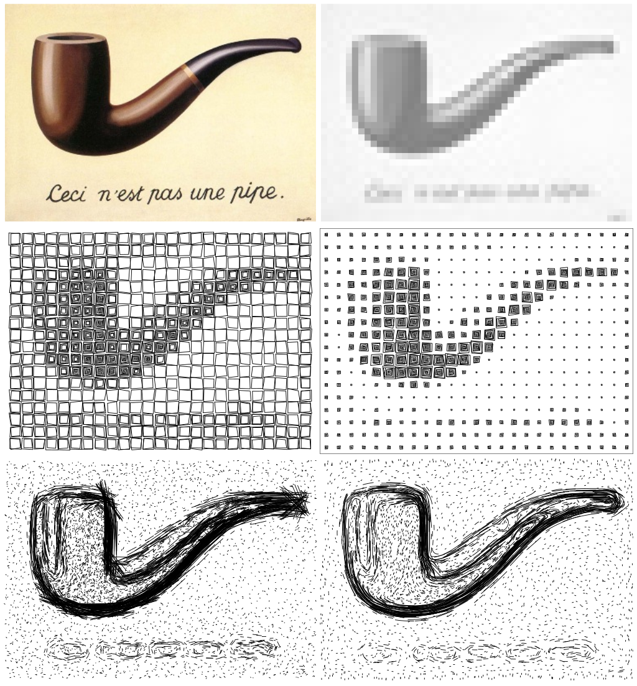

# ScribbleTrace

**Convert images to vector drawings for pen plotters**

ScribbleTrace transforms raster images (photos, artwork) into vector graphics (SVG) using various artistic algorithms. The output is optimized for pen plotters like the [AxiDraw](https://www.axidraw.com/), but works with any device that accepts SVG input.



## Features

- **Multiple algorithms**: Spirals, circles, squares, lines, curves, and hatching
- **Intensity-based rendering**: Darker areas produce denser patterns
- **Pen plotter optimized**: Minimizes pen lifts and travel distance
- **Clean SVG output**: Using the industry-standard svgwrite library
- **Interactive web GUI**: Real-time preview with NiceGUI
- **Modern Python**: Type hints, dataclasses, Python 3.10+
- **Easy to extend**: Add your own algorithms by subclassing `Algorithm`

## Installation

### From PyPI (recommended)

```bash
pip install scribbletrace
```

### From source

```bash
git clone https://github.com/kylberg/ScribbleTrace.git
cd ScribbleTrace
pip install -e .
```

### Dependencies

- Python 3.10 or higher
- numpy
- scikit-image
- scipy
- svgwrite
- Pillow
- nicegui (for the web GUI)

## Quick Start

### Command Line

```bash
# Basic usage with default spiral algorithm
scribbletrace photo.jpg output.svg

# Use a different algorithm
scribbletrace photo.jpg output.svg --algorithm hatching

# Adjust output resolution and intensity levels
scribbletrace photo.jpg output.svg --width 60 --levels 10

# Cross-hatching for a classic engraving look
scribbletrace photo.jpg output.svg --algorithm hatching --cross-hatch

# See all options
scribbletrace --help
```

### Web GUI

Launch the interactive web interface:

```bash
scribbletrace-gui
```

Opens a browser at `http://localhost:8080` with:

- **Input tab** — Image gallery with default sample; upload your own images
- **Proc tab** — Histogram adjustment, output width, levels, and live preview of processing stages
- **Vector tab** — Algorithm selection, parameter tuning, paper size/orientation, and SVG preview with zoom and backdrop options

The GUI supports saving/loading presets (JSON) and downloading the generated SVG.

### Python API

```python
from scribbletrace import load_image, preprocess, compute_gradients, SVGWriter
from scribbletrace.algorithms import Spirals, SpiralsConfig

# Load and preprocess image
image = load_image("photo.jpg")
processed = preprocess(image, output_width=40, levels=7)

# Apply algorithm
config = SpiralsConfig(normalize_spirals=True, connect_cells=True)
algorithm = Spirals(processed, config=config)
paths = algorithm.process()

# Export to SVG
width, height = algorithm.get_svg_dimensions()
writer = SVGWriter(paths, width=width, height=height)
writer.save("output.svg")
```

## Algorithms

### Spirals (`spirals`)

Archimedean spirals where the number of turns reflects intensity. Connected horizontally for efficient plotting.

```python
from scribbletrace.algorithms import Spirals, SpiralsConfig

config = SpiralsConfig(
    theta_resolution=50,      # Points per rotation
    normalize_spirals=True,   # Fit spirals to cell size
    connect_cells=True,       # Draw continuous rows
)
```

### Circles (`circles`)

Concentric circles in each cell. Number of circles based on intensity.

```python
from scribbletrace.algorithms import Circles, CirclesConfig

config = CirclesConfig(
    small_first=True,         # Draw inner circles first
    min_element_size=0.1,     # Smallest circle size
    max_element_size=1.0,     # Largest circle size
)
```

### Squares (`squares`)

Nested squares with slight vertex randomness for an organic feel.

```python
from scribbletrace.algorithms import Squares, SquaresConfig

config = SquaresConfig(
    small_first=True,
    randomness_vertex=0.1,    # Vertex displacement
)
```

### Lines (`lines`)

Short lines oriented perpendicular to image gradients. Requires gradient computation.

```python
from scribbletrace.algorithms import Lines, LinesConfig
from scribbletrace import compute_gradients

gradients = compute_gradients(processed.original)
config = LinesConfig(
    randomness_position=0.5,
    min_gradient_scale=0.1,
    max_gradient_scale=10.0,
)
algorithm = Lines(processed, config=config, gradients=gradients)
```

### Curves (`curves`)

Bézier curves that follow the gradient field. Creates flowing, organic patterns.

```python
from scribbletrace.algorithms import Curves, CurvesConfig

config = CurvesConfig(
    max_steps=4,              # Steps in each direction
    step_size=2.0,            # Distance per step
    bezier_samples=15,        # Smoothness of curves
)
```

### Hatching (`hatching`) ⭐ New

Cross-hatching patterns with variable density. Great for artistic renderings.

```python
from scribbletrace.algorithms import Hatching, HatchingConfig, HatchDirection

config = HatchingConfig(
    directions=[
        HatchDirection.DIAGONAL_RIGHT,
        HatchDirection.DIAGONAL_LEFT,
    ],
    min_spacing=0.3,          # Dense lines for dark areas
    max_spacing=2.0,          # Sparse lines for light areas
    optimize_path=True,       # Minimize pen travel
)
```

## API Reference

### Image Processing

```python
from scribbletrace import load_image, preprocess, compute_gradients

# Load image (returns grayscale numpy array)
image = load_image("photo.jpg")

# Preprocess for vectorization
processed = preprocess(
    image,
    output_width=40.0,    # Target width in cells
    levels=7,             # Intensity quantization levels
    invert=True,          # Dark areas = more marks
)

# Compute gradients (for lines/curves algorithms)
gradients = compute_gradients(
    image,
    quantize_magnitude=False,
    magnitude_levels=12,
)
```

### SVG Output

```python
from scribbletrace import SVGWriter
from scribbletrace.svg_output import PathSegment, SVGConfig

# Create writer with paths
writer = SVGWriter(paths, width=200, height=150)

# Or with custom config
config = SVGConfig(
    stroke_color="black",
    stroke_width=0.5,
    background=None,      # Transparent
    margin=10.0,
    units="mm",
)
writer = SVGWriter(paths, config=config)

# Save to file
writer.save("output.svg")

# Or get as string
svg_string = writer.to_string()
```

### Creating Custom Algorithms

```python
from scribbletrace.algorithms.base import Algorithm, AlgorithmConfig
from scribbletrace.svg_output import PathSegment
from dataclasses import dataclass

@dataclass
class MyConfig(AlgorithmConfig):
    my_param: float = 1.0

class MyAlgorithm(Algorithm):
    def __init__(self, image, config=None, gradients=None):
        super().__init__(image, config or MyConfig(), gradients)

    def process(self) -> list[PathSegment]:
        paths = []
        for c in range(self.width):
            for r in range(self.height):
                value = self.get_value(r, c)
                # Generate paths based on value...
                points = [(c, r), (c + 0.5, r + 0.5)]
                paths.append(PathSegment(points=points))
        return paths
```

## CLI Reference

```
usage: scribbletrace [-h] [-a ALGORITHM] [-w WIDTH] [-l LEVELS]
                     [--no-invert] [--stroke-width STROKE_WIDTH]
                     [--randomness RANDOMNESS]
                     [--hatch-directions {horizontal,vertical,diagonal_right,diagonal_left} ...]
                     [--cross-hatch] [-v] [--version]
                     input output

Convert images to vector drawings for pen plotters

positional arguments:
  input                 Input image file (JPEG, PNG, etc.)
  output                Output SVG file

options:
  -h, --help            show this help message and exit
  -a, --algorithm       Drawing algorithm: spirals, circles, squares,
                        lines, curves, hatching (default: spirals)
  -w, --width           Output width in cells (default: 40)
  -l, --levels          Intensity quantization levels (default: 7)
  --no-invert           Don't invert (dark areas produce more marks by default)
  --stroke-width        SVG stroke width in mm (default: 0.5)
  --randomness          Vertex randomness (default: 0.1)
  --hatch-directions    Hatching directions (for hatching algorithm)
  --cross-hatch         Use cross-hatching
  -v, --verbose         Verbose output
  --version             show program's version number and exit
```

## Example Results


**Top left**: Original image. **Top right**: Grayscale, quantized and downsampled version. **Middle left**: The *scribble squares* style, drawing squares from outside in. **Middle right**: The *scribble squares* style, drawing squares from inside out. **Bottom left**: The *scribble lines* style with straight lines along gradients. **Bottom right**: The *scribble curves* style, drawing short Bézier curves along gradients.

## Background & Inspiration

Around 2014 I stumbled upon the inspiring work by Sandy Noble on his [Polargraph drawing machine](http://www.polargraph.co.uk/). Drawing machines and plotters preexisting inkjet printers have always interested me but Sandy's work was something else.

The Polargraph control software implements several interesting strategies of halftoning—or if you like, tracing of bitmaps by drawing different patterns rather than just placing dots, with their distribution reflecting the bitmap intensity, which is a common strategy.

I like the idea of replacing pixels with patterns and I believe it all started with noticing halftoning in print. Another moment of inspiration was during my PhD when a colleague wrote software converting a bitmap into a picture of embroidery with cross stitches. Among the tracing styles on the Polargraph software there is one called "Norwegian pixels" that I like, and suddenly I stumbled upon an excellent small software called [ZebraTrace by Maxim Barabash](https://github.com/maxim-s-barabash/ZebraTrace/).

These moments of inspiration combined led me to create this repository.

## Legacy Code

The original prototype code is preserved in the `legacy/` folder for reference. If you were using the old scripts directly, you can still find them there:

```
legacy/
└── src/
    ├── ArchimedeanSpiral.py
    ├── scribbleCircle.py
    ├── scribbleCurves.py
    ├── scribbleLines.py
    ├── scribbleSquare.py
    └── scribbleWorm.y.py
```

The new modular architecture provides the same functionality with better organization, configuration options, and SVG output.

## Contributing

Contributions are welcome! Here are some ways to help:

- **Report bugs**: Open an issue with a description and sample image
- **Add algorithms**: Create a new algorithm by subclassing `Algorithm`
- **Improve documentation**: Help others use the library
- **Share your art**: Show us what you've created!

### Development Setup

```bash
git clone https://github.com/kylberg/ScribbleTrace.git
cd ScribbleTrace
pip install -e ".[dev]"

# Run tests
pytest

# Run linter
ruff check scribbletrace/
```

## License

GNU General Public License v3.0 - see [LICENSE](LICENSE) for details.

## Author

**Gustaf Kylberg** - [github.com/kylberg](https://github.com/kylberg)

---

*Made with ❤️ for the pen plotter community*

